# BPMN

Što je BPMN? 

 <a href="https://www.omg.org/spec/BPMN/2.0.2/PDF">Business Process Model and Notation</a> (BPMN 2.0) je grafička notacija koja predstavlja kompleksne procese. Održava ga neprofitabilna The Object Management Group (OMG)
  

BPMN **2.0.2.** specifikacija: [PDF](https://www.omg.org/spec/BPMN/2.0.2/PDF)

## Cilj

 Pružiti notaciju koji mogu lako razumijeti svi poslovni korisnici, od poslovnih analitičara koji kreiraju početne nacrte procesa do tehničik developera koji su odgovorni za implementaciju tehnologija koja će vršiti te procese.

> Omogućiti prenosivost definicija procesa između različitih alata.

- Služi kao most između **poslovnog** procesa i procesa **implementacije.**
- Osigurati da **XML** jezici dizajnirani za izvršavanje poslovnih procesa kao što je **WSBPEL** (Web Services Business Process Execution Language) mogu vizualizirati sa poslovno rijentiranom notacijom.
- Ovaj **Internacionalni Standard** definira notaciju i semantiku: **Kolaboracijskih** dijagrama, **Proces** dijagrama i **Koreografijskih** dijagrama.

## Sukladnost za modeliranje procesa

MORA koristiti sljedeče BPMN pakete: 

- BPMN **osnovni elementi**
- **process** dijagrame (procesi, aktivnosti)
- **kolaboracijski** dijagram (bazeni - pools, tok poruka - message flows)
- **konverzacijski** dijagrami (bazeni - pools, konverzacije, konverzacijski linkovi)

Sukladne subklase:

- **Deskriptipvna** - bavi se vidljivim elementima i atributima koji se koriste u modeliranju na visokoj razini (za analitičare koji su koristili BPA (Business Process Analysis) alate)
- **Analitička** - sadrži sve deskriptivne i pola konstrukta cjelovite sukladnosti Procesne modelacije. Bazira se na BPMN obuci te analizi korisničkih obrazaca u Odjelu za obranu. Fokusira se na okvir arhitekture, temeljen na iskustvu, s planiranom standardizacijom.
- **Common Executable** - fokusira se na ono što je potrebno za executable proces model

## Grafički izgled

 BPMN proces dijagram <b>MORA</b> koristiti grafičke elemente, oblike i markere ilustrirane u Internacijonalnom Standardu

> Veličina, boja, debljina linije i pozicija teksta su fleksibilni.

### Tipografske i jezičke konvencije i stil

- [RFC-2119](https://datatracker.ietf.org/doc/html/rfc2119) - MUST, MUST NOT, SHOULD, SHOULD NOT, MAY definicije
- Operators:
    - `<none>` - točno jednom
    - `[0..1]` - 0 or 1
    - `[0..*]` - 0 ili više
    - `[1..*]` - 1 ili više
- Atributi su odvojeni pomoću `|` ange grupirani unutar `{ and }` - alternativnih vrijednosti
    - `<value>` — default-na vrijednost
    - `<type>` — vrst atributa
    
- **WSBPEL** - Web Services Business Process Execution Language - 2.0
    - formalno definira poslovne procese, ali je optimiziran za softversko izvršavanje, manje prikladan za ljudsku upotrebu
    - temelji se temelji na matematičkim modelima poput pi-kalkulusa. No, zbog kompleksnosti, oblik procesa može biti teško razumljiv analitičarima i menadžerima
- **WSDL** - Web Service Description Language - W3C

> **Korišteni standardi:** XML Schema, XPath i WSDL za definiciju tipova podataka, izraza i operacija usluga.

## Tipovi modela

1. **Procesi (Orkestracija):**
    - *Privatni* (unutarnji) poslovni procesi (izvršni i neizvršni).
        - Podijeljeni u jedan bazen (pool) ako se koristi notacija poput plivališta (swimlanes).
        
        
        
    - *Javni* procesi koji predstavljaju interakcije s drugim procesima ili sudionicima.
        - Prikazuju interakcije između privatnih poslovnih procesa i drugih sudionika.
        - Ograničeni na aktivnosti koje komuniciraju s vanjskim sudionicima.
        
        
        
2. **Koreografije:** Opisuju interakcije između više poslovnih entiteta.
    - Samostalno definiraju očekivano ponašanje između sudionika, bez centralnog kontrolera.
        
        
        
3. **Kolaboracije:** Prikazuju interakcije između dva ili više entiteta, uključujući procese i/ili koreografije.
    - Prikazuju interakcije između više poslovnih entiteta, uključujući Pools, procese i/ili koreografije.
        
        
        
- **Konverzacije:**
    - Logički odnosi izmjena poruka između Pools u dijagramu razgovora.
    - Prikažu različite konverzacije vezane uz poslovne scenarije.
        
        
        
    
    ### **Perspektiva dijagrama:**
    
    > Svaki sudionik može imati različite perspektive o tome kako će se procesi primijeniti na njih. Aktivnosti mogu biti unutarnje ili vanjske za sudionika, a različiti sudionici imaju različite perspektive o tome koje su unutarnje ili vanjske. Razlika između unutarnjih i vanjskih aktivnosti je važna za praćenje statusa ili rješavanje problema, ali sam dijagram ostaje isti.
    
    > **Prikaz više perspektiva:** Primjer dijagrama s dva stajališta je proces koji uključuje pacijenta i ured doktora. Iako dijagram prikazuje aktivnosti oba sudionika, svaki sudionik kontrolira samo vlastite aktivnosti u stvarnom izvođenju.
    
    > **Ponašanje dijagrama:** Kroz standard se koristi pojam ***tokena*** koji prolazi kroz tokove sekvenci i elemente u procesu. Token je teoretski koncept pomoći u definiranju ponašanja procesa, ali implementacija BPMN alata nije obavezna koristiti oblik tokena. Početni događaj generira token koji se mora na kraju potrošiti na završnom događaju. Put tokena je pratljiv kroz mrežu tokova sekvenci, prelaza i aktivnosti unutar procesa.

## BPMN elementi:

**Osnovne kategorije elemenata u BPMN:**

1. **Tok objekata (Flow Objects):**
    - Definiraju ponašanje poslovnog procesa.
    - Uključuju događaje, aktivnosti i prelaze.
    - Tok objekata:
        - **Događaji (Events), Aktivnosti (Activities), Prelazi (Gateways).**
2. **Podaci (Data):**
    - Predstavljeni četiri elementa: objekti podataka, ulazi podataka, izlazi podataka, pohrana podataka
    - Elementi podataka:
        - **Objekti podataka (Data Objects), Ulazi podataka (Data Inputs), Izlazi podataka (Data Outputs), Pohrana podataka (Data Stores)**
3. **Objekti povezivanja (Connecting Objects):**
    - Omogućuju povezivanje tokova objekata i drugih informacija.
    - Uključuju tokove sekvenci, tokove poruka, udruženja i udruženja podataka.
    - Povezujući objekti:
        - **Tokovi sekvenci (Sequence Flows), Tokovi poruka (Message Flows), Udruženja (Associations), Udruženja podataka (Data Associations)**
4. **Swimlanes:**
    - Grupiranje osnovnih elemenata modeliranja putem "Swimlanes" (bazeni i staze).
    - Dva načina grupiranja elemenata:
        - **Bazeni (Pools), Staze (Lanes).**
5. **Artefakti (Artifacts):**
    - Pružaju dodatne informacije o procesu.
    - Standardizirani artefakti uključuju grupu i tekstualnu bilješku.
    - Dodatne informacije:
        - **Grupa (Group), Tekstualna bilješka (Text Annotation)**

### Osnovni BPMN Modeling Elementi
---
<table>
  <thead>
    <tr>
      <th>Element</th>
      <th>Opis</th>
      <th>Notacija</th>
    </tr>
  </thead>
  <tbody>
    <tr>
      <td><code>Event (Događaj)</code></td>
      <td>
Događaj je nešto što "se događa" tijekom procesa ili koreografije.
     
Događaji utječu na tok modela i obično imaju uzrok (okidač) ili posljedicu (rezultat).
  
Događaji su prikazani kružnicama s otvorenim središtima kako bi se omogućilo označavanje različitih okidača ili rezultata.
  
Postoje tri vrste događaja: Početak (Start), Intermedijarni (Intermediate) i Kraj (End).        
      </td>
      <td>
      
      </td>      
    </tr>
    <tr>
      <td><code> Activity (Aktivnost) </code></td>
      <td>
Aktivnost je opći pojam za posao koji tvrtka obavlja u procesu.
    
Aktivnost može biti atomična ili neatomna (složena).
    
Tipovi aktivnosti u modelu procesa su Podproces (Sub-Process) i Zadatak (Task), prikazani zaobljenim pravokutnicima.
    
Aktivnosti se koriste i u standardnim procesima i u koreografijama.    
      </td>
      <td>
      
      </td>      
    </tr>
    <tr>
      <td><code> Gateway (Prolaz) </code></td>
      <td>
Koristi se za kontrolu odvajanja i spajanja tokova sekvenci u procesu.
  
Određuje grananje, razgranavanje, spajanje i pridruživanje putanja.
  
Interni markeri označavaju vrstu kontrole ponašanja.  
      </td>
      <td>
      
      </td>      
    </tr>
    <tr>
      <td><code> Sequence Flow (Tok sekvenci) </code></td>
      <td>
Koristi se za prikazivanje redoslijeda izvođenja aktivnosti u procesu.
  
Definira kako će se aktivnosti izvršavati jedna za drugom u procesu ili koreografiji.
      </td>
      <td>
      
      </td>      
    </tr>
    <tr>
      <td><code> Message Flow (Tok Poruka) </code></td>
      <td>
Koristi se za prikazivanje toka poruka između dva sudionika spremna poslati i primiti poruke.
  
U BPMN-u, dva odvojena bazena u dijagramu suradnje predstavljaju dva sudionika (npr., PartnerEntities i/ili PartnerRoles).
      </td>
      <td>
      
      </td>      
    </tr>
    <tr>
      <td><code> Association (Asocijacija) </code></td>
      <td>
Koristi se za povezivanje informacija i artefakata s grafičkim elementima u BPMN-u.
  
Tekstualne bilješke (Text Annotations) i drugi artefakti mogu biti povezani s grafičkim elementima.
  
Vrh strelice na udruženju označava smjer toka (npr., podataka) kad je primjereno.
      </td>
      <td>
      
      </td>      
    </tr>
    <tr>
      <td><code> Pool (Bazen) </code></td>
      <td>
Grafički prikaz sudionika u suradnji.
  
Djeluje kao "plivačka staza" i grafički kontejner za razdvajanje skupa (set) aktivnosti od drugih bazena, obično u kontekstu B2B situacija.
  
Bazen može imati interne detalje u obliku procesa koji će se izvršiti, ili može biti "crna kutija" bez internih detalja.
      </td>
      <td>
      
      </td>      
    </tr>
    <tr>
      <td><code> Lane (Staza) </code></td>
      <td>
Podjedinica unutar procesa, ponekad unutar bazena, koja se proteže cijelom dužinom procesa, vertikalno ili horizontalno.
  
Koriste se za organiziranje i kategorizaciju aktivnosti.
      </td>
      <td>
      
      </td>      
    </tr>
    <tr>
      <td><code> Data Object (Objekt Podatka) </code></td>
      <td>
Pružaju informacije o tome što aktivnosti zahtijevaju ili proizvode.
  
Mogu predstavljati pojedinačni objekt ili kolekciju objekata.
  
Data Input i Data Output pružaju iste informacije za procese.
      </td>
      <td>
      
      </td>      
    </tr>
    <tr>
      <td><code> Message (Poruka) </code></td>
      <td>
Koristi se za prikaz sadržaja komunikacije između dva sudionika (definiranih poslovnim PartnerRole ili PartnerEntity).
      </td>
      <td>
      
      </td>      
    </tr>
    <tr>
      <td><code> Group (Grupa) </code></td>
      <td>
Grupiranje grafičkih elemenata unutar iste kategorije.
  
Ne utječe na tokove sekvenci unutar grupe.
  
Kategorija se pojavljuje kao oznaka grupe na dijagramu i može se koristiti u svrhe dokumentacije ili analize.
      </td>
      <td>
      
      </td>      
    </tr>
    <tr>
      <td><code> Text Annotations (Tekstualne bilješke) </code></td>
      <td>
Mehanizam kojim modeler pruža dodatne tekstualne informacije čitatelju BPMN dijagrama.
      </td>
      <td>
      
      </td>      
    </tr>
  </tbody>
</table>

### Prošireni BPMN Modeling Elementi
---
<table>
  <thead>
    <tr>
      <th>Element</th>
      <th>Opis</th>
      <th>Notacija</th>
    </tr>
  </thead>
  <tbody>
    <tr>
      <td><code>Flow Dimension (Tok Dimenzija): Start, Intermediate, End</code></td>
      <td>
<b>Start Event (Početni događaj):</b>

- Označava gdje će određeni proces ili koreografija započeti.

<b>Intermediate Events (Intermedijarni događaji ):</b>

- Pojavljuju se između Početnog i Završnog događaja.
- Utječu na tok procesa ili koreografije, ali ne pokreću ga izravno.

<b>End Event (Završni događaj ):</b>

- Označava gdje će proces ili koreografija završiti.
      </td>
      <td>
      
      </td>      
    </tr>
    <tr>
      <td><code>Event Dimension (Tip Dimenzije): None, Message, Timer, Error, Cancel, Compensation, Conditional, Link, Signal, Multiple, Terminate</code></td>
      <td>
<b>Okidači (Triggers):</b>

- Početni i neki intermedijarni događaji imaju "okidače" koji definiraju uzrok događaja.
- Okidači mogu biti različiti (npr., Message, Timer).
- Krajnji događaji mogu definirati "rezultat" kao posljedicu završetka toka sekvenci.
- Početni događaji mogu samo reagirati ("uhvatiti") okidač.
- Krajnji događaji mogu samo stvarati ("baciti") rezultat.
- Intermedijarni događaji mogu uhvatiti ili baciti okidače.

<b>Ponovna uporaba događaja (Interrupting/Non-Interrupting):</b>

- Neki događaji, koji su korišteni za prekid aktivnosti se mogu koristiti u načinu koji ne prekida.
- Rub događaja koji ne prekidaju je iscrtkan
      </td>
      <td>
      
      </td>      
    </tr>
    <tr>
      <td><code>Task (Zadatak) - Atomic</code></td>
      <td>
Atomski zadatci unutar procesa koji se koriste kada rad u procesu nije razbijen na finije razine procesnih detalja.
      </td>
      <td>
      
      </td>      
    </tr>
    <tr>
      <td><code>Choreography Task (Koreografski Zadatak)</code></td>
      <td>
Atomski zadatci u koreografiji predstavljaju set od jedne (1) ili više razmjena poruka.
  
Uključuju dva (2) sudionika (Participants) i prikazuju se u trakama grafičke oznake oblika.
  
Ime Choreography Task-a i svakog sudionika prikazani su u različitim trakama koje čine grafičku oznaku oblika.
      </td>
      <td>
      
      </td>      
    </tr>
    <tr>
      <td><code>Sub-Process (Podproces)</code></td>
      <td>
Složeni zadatak uključen unutar procesa ili koreografije.
  
Može se razložiti na finije razine detalja (proces ili koreografija) putem skupa podzadataka (Subactivities).
      </td>
      <td>
       Sljedeće 4 anotacije
      </td>      
    </tr>
    <tr>
      <td><code>Collapsed Sub-Process (Skriveni Podproces)</code></td>
      <td>
Detalji skrivenog podprocesa nisu vidljivi na dijagramu.
  
"Plus" znak u donjem centru oblika označava da je aktivnost podprocesa i ima nižu razinu detalja.
      </td>
      <td>
      
      </td>      
    </tr>
    <tr>
      <td><code>Expanded Sub-Process (Prošireni Podproces)</code></td>
      <td>
Granica proširenog podprocesa je proširena, a detalji (proces) su vidljivi unutar njegove granice.
  
Napomena: Sekvencijski tokovi ne mogu prijeći granicu podprocesa.
      </td>
      <td>
      
      </td>      
    </tr>
    <tr>
      <td><code>Collapsed SubChoreography (Skriveni podkoreografski proces)</code></td>
      <td>
Detalji skupljenog podkorografskog zadatka nisu vidljivi na dijagramu.
  
"Plus" znak u donjem središtu pojasa s nazivom zadatka ukazuje da je aktivnost podprocesa i ima nižu razinu detalja.
      </td>
      <td>
      
      </td>      
    </tr>
    <tr>
      <td><code>Expanded SubChoreography (Proširena Podkoreografski Proces)</code></td>
      <td>
Granice proširene podkorografske aktivnosti su proširene, a detalji (koreografija) su vidljivi unutar granica.
  
Napomena da tokovi sekvenci ne mogu prijeći granice podkorografske aktivnosti.
      </td>
      <td>
      
      </td>      
    </tr>
    <tr>
      <td><code>Gateway Control Types (Tipovi Upravljanja Prolazom)</code></td>
      <td>
Ikonice unutar dijamantskog oblika Gatewayja ukazuju na vrstu ponašanja kontrole toka.

Vrste kontrole uključuju:

- **Exclusive decision** (Ekskluzivna odluka) i spajanje: Oba izuzetna i događajno bazirana izvode izuzetne odluke i spajanje. Izuzetna odluka može biti prikazana s ili bez "X" markera.
- **Event-Based** (Događajno baziran) i **Parallel Event-based** (Paralelno događajno baziran) **Gateway**: Mogu pokrenuti novi primjerak procesa.
- **Inclusive** (Inkluzivan) **Gateway** odluka i spajanje
- **Complex** (Kompleksni) **Gateway:** Kompleksni uvjeti i situacije (npr. 3 od 5)
- **Parallel** (Paralelni) **Gateway** grananje i spajanje

Svaki tip kontrole utječe na ulazni i izlazni tok.
      </td>
      <td>
      
      </td>      
    </tr>
    <tr>
      <td><code>Normal Flow (Normalni Tok)</code></td>
      <td>
Putovi Sequence Flow-a koji ne započinju s Intermediate Event-om pričvršćenim na granicu aktivnosti.
      </td>
      <td>
      
      </td>      
    </tr>     
    </tr>
    <tr>
      <td><code>Uncontrolled Flow (Nekotrolirani Tok)</code></td>
      <td>
Tok koji nije pod utjecajem nikakvih uvjeta niti prolazi kroz Gateway. Najjednostavniji primjer je pojedinačni Sequence Flow koji povezuje dvije aktivnosti. 
  
Ovo se također može primijeniti na višestruke Sequence Flow-ove koji konvergiraju ili divergiraju od aktivnosti. 
  
Za svaki neupravljani Sequence Flow token će teći od izvornog objekta kroz Sequence Flow-ove do odredišnog objekta.
      </td>
      <td>
      
      </td>      
    </tr>
    <tr>
      <td><code>Conditional flow (Uvjetni Tok)</code></td>
      <td>
Sequence Flow može imati *uvjetni izraz* koji se procjenjuje tijekom izvođenja kako bi se odredilo hoće li se Sequence Flow koristiti (tj. hoće li token putovati niz Sequence Flow).

- Ako je uvjetni tok izlazan iz aktivnosti, tada će Sequence Flow imati minijaturni dijamant na početku spojnice.
- Ako je uvjetni tok izlazan iz Gateway-a, tada linija neće imati minijaturni dijamant
      </td>
      <td>
      
      </td>      
    </tr>
    <tr>
      <td><code>Default Flow (Zadani Uvjetni Tok)</code></td>
      <td>
Za uvjetne tokove na temelju podataka (Data-Based) Exclusive Gateway-a ili Inclusive Gateway-a, jedan tip toka je Zadani uvjetni tok. 
  
Ovaj tok će se koristiti samo ako svi drugi izlazni uvjetni tokovi nisu istiniti tijekom izvođenja. Ti Sequence Flow-ovi imat će kosu crtu dodanu na početku spojnice.
      </td>
      <td>
      
      </td>      
    </tr>
    <tr>
      <td><code>Exception Flow (Tok iznimke)</code></td>
      <td>
Pojavi se izvan normalnog tijeka procesa i temelji se na Intermediary Eventu pričvršćenom na granicu aktivnosti koji se događa tijekom izvođenja procesa.
      </td>
      <td>
      
      </td>      
    </tr>
    <tr>
      <td><code>Compensation Association (Asocijacija Kompenzacije)</code></td>
      <td>
Pojavljuje se izvan normalnog toka procesa i temelji se na Intermediary Eventu kompenzacije koji se pokreće neuspjehom transakcije ili događajem bacanja kompenzacije. 
  
Cilj Asocijacije MORA biti označen kao Aktivnost kompenzacije.
      </td>
      <td>
      
      </td>      
    </tr>
    <tr>
      <td><code>Data Objects (Objekti Podataka)</code></td>
      <td>
Pružaju informacije o tome što aktivnosti zahtijevaju ili proizvode.
  
Mogu predstavljati pojedinačni objekt ili kolekciju objekata.
  
Data Input i Data Output pružaju iste informacije za procese.
      </td>
      <td>
      
      </td>      
    </tr>
    <tr>
      <td><code>Fork (Razgranavanje)</code></td>
      <td>
Proces razgranavanja dijeli put u dva ili više paralelnih puteva (poznato i kao AND-Split). To je mjesto u procesu gdje se aktivnosti mogu izvoditi istovremeno, umjesto sekvencijalno.

**Opcije:**

- **Multiple Outgoing Sequence Flows** (Višestruki odlazni tokovi sekvenci): Preferirana metoda za "nekontrolirani" tok u većini situacija.
- **Parallel Gateway** (Paralelni odlazni prolaz): Rijetko korištena opcija, obično u kombinaciji s drugim prolazima.
      </td>
      <td>
      
      </td>      
    </tr>
    <tr>
      <td><code>Join (Spajanje)</code></td>
      <td>
- Pojam "join" u BPMN-u odnosi se na spajanje dva ili više paralelnih puteva u jedan put (poznato i kao AND-Join ili sinkronizacija).
- **Korištenje Parallel Gateway-a (**paralelnih prolaza): koriste se za prikazivanje spajanja višestrukih sekvencijskih tokova.
      </td>
      <td>
      
      </td>      
    </tr>
    <tr>
      <td><code>Decision, Branching
Point (Odluka, Točka Grananja)</code></td>
      <td>
Odluke su prolazi unutar procesa ili koreografije gdje tok kontrole može krenuti jednim ili više alternativnih putanja.
      </td>
      <td>
       Sljedećih 5 redova
      </td>      
    </tr>
    <tr>
      <td><code>Exclusive (Ekskluzivna)</code></td>
      <td>
Ova odluka predstavlja točku grananja gdje su alternative temeljene na uvjetnim izrazima unutar odlaznih tokova sekvenci.
  
Samo jedna od alternativa će biti odabrana. 
      </td>
      <td>
      
      </td>      
    </tr>
    <tr>
      <td><code>Event-based (Ovisno o događaju)</code></td>
      <td>
Ova odluka predstavlja točku grananja gdje alternative ovise o događaju koji se događa u toj točki u procesu ili koreografiji. Specifični događaj, obično primitak poruke, određuje koji će put biti odabran. Mogu se koristiti i druge vrste događaja, poput vremenskog alarma. Samo jedna od alternativa će biti odabrana. Postoje dvije opcije za primanje poruka:

- Mogu se koristiti zadaci tipa "Receive" (pogledaj sliku gore-desno).
- Mogu se koristiti međuaktivnosti tipa "Message" (pogledaj sliku dolje-desno).
      </td>
      <td>
      
      </td>      
    </tr>
    <tr>
      <td><code>Inclusive (Inkluzivan)</code></td>
      <td>
Ova odluka predstavlja točku grananja gdje alternative ovise o uvjetnim izrazima sadržanim u odlaznim redoslijedima (pogledaj stranicu 291). U nekom smislu, to je grupiranje povezanih nezavisnih binarnih (da/ne) odluka. Budući da su svi putovi nezavisni, moguće je uzeti sve kombinacije putova, od nijednog do svih. Međutim, trebalo bi biti dizajnirano tako da se barem jedan put uzme. Zadani uvjet može se koristiti kako bi se osiguralo da se uzme barem jedan put. Postoje dvije verzije ovog tipa odluke:

- Prva koristi kolekciju uvjetnih redoslijeda, označenih minidijamantima (pogledaj gornju-desnu sliku).
- Druga koristi inkluzivni prolaz (Inclusive Gateway) (pogledaj donju-desnu sliku).
      </td>
      <td>
      
      </td>      
    </tr>
    <tr>
      <td><code>Merging (Spajanje)</code></td>
      <td>
BPMN koristi termin "merge" kako bi označio ekskluzivno spajanje dvaju ili više putanja u jednu putanju (poznato i kao OR-Join). 
  
Merging Exclusive Gateway-a koristi se za prikaz spajanja višestrukih redoslijeda (pogledaj gornju sliku desno). Ako je sva dolazna struja alternativna, tada Gateway nije potreban. Drugim riječima, nekontrolirana struja pruža isto ponašanje (pogledaj donju sliku desno).
      </td>
      <td>
      
      </td>      
    </tr>
    <tr>
      <td><code>Looping (Petlja)</code></td>
      <td>
BPMN pruža dva mehanizma za petljanje unutar procesa.
      </td>
      <td>
       Sljedeće 2 anotacije
      </td>      
    </tr>
    <tr>
      <td><code>Activity Looping (PetljaS Aktivnosti)</code></td>
      <td>
Atributi Zadataka i Podprocesa određuju hoće li se ponavljati ili izvoditi jednom. Postoje dva tipa petljanja: Standardno i Višestruko instanciranje.
  
Mali indikator petljanja bit će prikazan na dnu sredine aktivnosti.
      </td>
      <td>
      
      </td>      
    </tr>
    <tr>
      <td><code>Sequence Flow Looping (Petlja Slijeda Toka)</code></td>
      <td>
Petlje se mogu stvoriti povezivanjem Slijeda toka s "uzvodnim" objektom.
  
Objekt se smatra uzvodnim ako taj objekt ima izlazni Slijed toka koji vodi do niza drugih Slijedova toka, pri čemu je posljednji od njih ulazni Slijed toka za izvorni objekt.
      </td>
      <td>
      
      </td>      
    </tr>
    <tr>
      <td><code>Multiple Instances (Višestruke Instance)</code></td>
      <td>
Atributi Zadataka i Podprocesa određuju hoće li se ponavljati ili izvoditi jednom.
- Za sekvencijalne Multi-Instance prikazat će se skup od tri horizontalne linije na donjem centru aktivnosti (vidi gornju sliku desno).
- Za paralelne Multi-Instance prikazat će se skup od tri vertikalne linije na donjem centru aktivnosti (vidi donju sliku desno).
      </td>
      <td>
      
      </td>      
    </tr>
    <tr>
      <td><code>Process Break (Prekid Procesa)</code></td>
      <td>
Lokacija u procesu koja pokazuje gdje će se očekivati kašnjenje.
  
Koristi se Intermediary Event za prikaz stvarnog ponašanja (vidi gornju sliku desno).
  
Dodatno, Artifact nazvan "Process Break", dizajniran od strane modelera ili alata za modeliranje, može biti povezan s događajem kako bi istaknuo mjesto odgode unutar tijeka.
      </td>
      <td>
      
      </td>      
    </tr>
    <tr>
      <td><code>Transaction (Transakcija)</code></td>
      <td>
Podproces podržan posebnim protokolom koji osigurava potpuno suglasje svih uključenih strana o tome treba li se aktivnost dovršiti ili otkazati.
  
Atributi aktivnosti određuju je li aktivnost transakcija.
  
Dvostruka linija okvira označava da je podproces transakcija.
      </td>
      <td>
      
      </td>      
    </tr>
    <tr>
      <td><code>Nested/Embedded SubProcess (Ugnježdeni Podproces)</code></td>
      <td>
Aktivnost koja dijeli isti skup podataka s roditeljskim procesom.
  
Za razliku od neovisnog, ponovno upotrebljivog podprocesa koji se referencira iz roditeljskog procesa, podaci se moraju prenijeti u referencirani podproces, ali ne i u ugnježdeni podproces.
      </td>
      <td>
      
      </td>      
    </tr>
    <tr>
      <td><code>Off-Page Connector (Poveznica Izvan Stranice)</code></td>
      <td>
Obično se koristi za ispis, ovaj objekt pokazuje gdje tok sekvence napušta jednu stranicu i zatim se ponovno pokreće na sljedećoj stranici.
  
Kao Off-Page Connector može se koristiti Link Intermediate Event (Poveznica Intermediary Događaj).
      </td>
      <td>
      
      </td>      
    </tr>
  </tbody>
</table>

--

## Proces
> Opisuje slijed ili tok aktivnosti u organizaciji s ciljem obavljanja posla. U BPMN-u, proces se prikazuje kao graf elemenata toka, koji čine skup aktivnosti, događaja, prolaza i vrata koji definiraju konkretne semantike izvođenja. Procesi se mogu definirati na različitim razinama, od procesa na razini poduzeća do procesa koje izvodi pojedinac. Niske razine procesa mogu se grupirati kako bi se postigao zajednički poslovni cilj.

- **Collaboration** (Suradnja): Termin koji se koristi u BPMN-u kada se modelira interakcija između procesa.

- **Choreography** (Koreografija): Također termin koji se koristi u BPMN-u kada se modelira interakcija između procesa.

- **Flow Elements** (Elementi toka): Skup aktivnosti, događaja, vrata i prolaza koji čine proces u BPMN-u.

- **CallableElement (Pozivni element):** Omogućuje referenciranje i ponovnu upotrebu procesa putem konstrukta Call Activity. Proces može referencirati skup sučelja koja definiraju njegovo vanjsko ponašanje.

  - **Call Activity (Poziv aktivnosti):** Konstrukt koji omogućuje referenciranje i korištenje drugih procesa unutar jednog procesa.

- **FlowElementContainer (Kontejner elemenata toka):** Nasljeđuje atribute i modelne veze od CallableElement i FlowElementContainer.

- **Expressions (Izrazi):** Vrijednosti atributa koje se mogu referencirati putem izraza. Dostupne su samo tijekom izvođenja procesa.

### Vrste procesa

---

1. *Privatni* (unutarnji) poslovni procesi (izvršni i neizvršni).
    - Podijeljeni u jedan bazen (pool) ako se koristi notacija poput plivališta (swimlanes).
    
    
    
2. *Javni* procesi koji predstavljaju interakcije s drugim procesima ili sudionicima.
    - Prikazuju interakcije između privatnih poslovnih procesa i drugih sudionika.
    - Ograničeni na aktivnosti koje komuniciraju s vanjskim sudionicima.
    
    

### Activity (Aktivnost)

---

> Rad koji se obavlja unutar poslovnog procesa, može biti atomski ili nijedinstven (složen). Tipovi aktivnosti uključuju Zadatak (Task), Podproces (Sub-Process) i Pozivnu Aktivnost (Call Activity), koja omogućuje uključivanje ponovno upotrebljivih zadataka i procesa na dijagram. Aktivnost nije specifični grafički objekt, već skup grafičkih objekata.

Vrste aktivnosti:
- **Task (Zadatak):** Konkretna aktivnost koja predstavlja izvršni element u BPMN procesu. Predstavlja točku u tijeku procesa gdje se obavlja rad. Može biti atomski ili nijedinstven.
- **Sub-Process (Podproces):** Aktivnost koja predstavlja podproces unutar glavnog procesa. Može biti složena i razgrađivati se na više detaljnih aktivnosti. 
- **Call Activity (Pozivna Aktivnost):** Aktivnost koja omogućuje uključivanje ponovno upotrebljivih zadataka i procesa unutar dijagrama.
- **Activity Instance (Instanca Aktivnosti):** Primjerak aktivnosti koji ima atribute čije se vrijednosti mogu referencirati putem izraza. Te vrijednosti su dostupne samo tijekom izvođenja aktivnosti.

### Task (Zadatak)

---

> Atomarna aktivnost unutar toka poslovnog procesa koju izvodi krajnji korisnik ili aplikacija. Može biti oblikovan s različitim oznakama ovisno o svojoj prirodi.

<table>
  <thead>
    <tr>
      <th>Zadatak</th>
      <th>Opis</th>
      <th>Notacija</th>
    </tr>
  </thead>
  <tbody>
    <tr>
      <td><code>Service Task (Zadatka Servis)</code></td>
      <td>
Zadatak koji koristi neku vrstu usluge, kao što su web servisi ili automatizirane aplikacije. Ima oznaku servisa u gornjem lijevom kutu. 
      </td>
      <td>
      
      </td>      
    </tr>
    <tr>
      <td><code>Send Task (Zadatka Slanja)</code></td>
      <td>
Jednostavan zadatak za slanje poruke vanjskom sudioniku. Završava se nakon slanja poruke.
      </td>
      <td>
      
      </td>      
    </tr>
    <tr>
      <td><code>Receive Task (Zadatka Prijema)</code></td>
      <td>
Jednostavan zadatak koji čeka na dolazak poruke od vanjskog sudionika. Završava se nakon primitka poruke.
      </td>
      <td>
      
      </td>      
    </tr>
    <tr>
      <td><code>User Task (Korisnički Zadatak)</code></td>
      <td>
Tipičan "workflow" zadatak gdje ga izvodi ljudski izvođač uz pomoć softverske aplikacije. Označen je slikom ljudskog lika.
      </td>
      <td>
      
      </td>      
    </tr>
    <tr>
      <td><code>Manual Task (Ručni Zadatak)</code></td>
      <td>
Zadatak koji se očekuje da će se izvršiti bez pomoći izvršnog procesnog stroja ili aplikacije. Označen je slikom ruke.
      </td>
      <td>
      
      </td>      
    </tr>
    <tr>
      <td><code>Business Rule Task (Zadatak Poslovnog Pravila)</code></td>
      <td>
Pruža mehanizam za slanje podataka poslovnom pravilu i primanje izlaza pravila. Ima oznaku poslovnog pravila u gornjem lijevom kutu.
      </td>
      <td>
      
      </td>      
    </tr>
    <tr>
      <td><code>Script Task (Skriptni Zadatak)</code></td>
      <td>
Izvršava se putem poslovnog procesnog stroja koristeći definiranu skriptu. Ima oznaku skripte u gornjem lijevom kutu.
      </td>
      <td>
      
      </td>      
    </tr>
  </tbody>
</table>

---

Svi zadaci mogu imati oznake poput petlji ili višestrukih instanci, a te oznake trebaju biti grupirane i smještene na dnu oblika.

> **Global Task (Globalni Zadatak):** Ponovno upotrebljiva, atomska definicija zadatka koju je moguće pozivati iz bilo kojeg procesa putem Pozivne Aktivnosti. Globalni Zadatak nasljeđuje atribute i modelne asocijacije od Pozivnog Elementa.

- Tipovi Globalnih Zadataka uključuju GlobalUserTask, GlobalManualTask, GlobalScriptTask i GlobalBusinessRuleTask.
- Ponašanje, atributi i modelne asocijacije definirane za standardne zadatke primjenjuju se i na odgovarajuće vrste Globalnih Zadataka.

*Ove vrijednosti su dostupne samo tijekom izvođenja procesa.*

### Sub-Process (Podproces)

---

> Aktivnost čiji su interni detalji modelirani korištenjem drugih aktivnosti, vrata, događaja i tokova. Može biti otvorena da pokaže nižu razinu procesa. Embedded Sub-Process (Ugrađeni Podproces) označen s kvadratićem unutar zaobljenog pravokutnika. Može biti skriven ili proširen da pokaže detalje.

- **Reusable Sub-Process (Ponovljivi Podproces):** Podproces koji odgovara Call Activity-u iz BPMN 1.2, poziva unaprijed definirani proces.

<table>
  <thead>
    <tr>
      <th>Proces</th>
      <th>Opis</th>
      <th>Notacija</th>
    </tr>
  </thead>
  <tbody>
    <tr>
      <td><code>Event Sub-Process (Događajni Podproces)</code></td>
      <td>
Specijalizirani podproces koji se pokreće događajem, ima početni događaj s okidačem. Ne utječe na normalni tijek roditeljskog procesa.
      </td>
      <td>
      
      
      </td>      
    </tr>
    <tr>
      <td><code>Transaction Sub-Process (Transakcijski Podproces)</code></td>
      <td>
Specijalizirani podproces s ponašanjem kontroliranim transakcijskim protokolom. Granica mu je dvostruko iscrtana.
      </td>
      <td>
      
      
      </td>      
    </tr>
    <tr>
      <td><code>Ad-Hoc Sub-Process (Ad-Hoc Podproces)</code></td>
      <td>
Skup aktivnosti bez obvezujućih veza, određen dinamikom izvođača. Označava se simbolom "tilde" na dnu.
      </td>
      <td>
      
      
      </td>      
    </tr>
  </tbody>
</table>

Svi podprocesi mogu imati dodatne oznake poput petlji ili višestrukih instanci, a te oznake trebaju biti grupirane na dnu oblika.

- Collapsed Sub-Process Markers (Skriveni Markeri Podprocesa)

### Call Activity (Pozivna Aktivnost)

> Identificira točku u procesu gdje se koristi globalni proces ili globalni zadatak. Djeluje kao "omotač" za pozivanje globalnog procesa ili zadatka, prenoseći kontrolu izvršavanja.

- Oblik Call Activity-ja je pravokutnik s zaobljenim kutovima, s debelim rubom.
- Ako poziva Globalni Zadatak, oblik će biti isti kao i za Zadatak, ali s debelim rubom.
- Marker vrste Globalnog Zadatka (npr. User Task) mora biti prikazan na Call Activity-ju.
- Ako poziva Proces, oblik može biti kao skriveni ili prošireni Podproces, s debelim rubom ovisno o dostupnosti detalja pozvanog procesa.

*Ove vrijednosti su dostupne samo tijekom izvođenja procesa.*

### Loop Characteristics (Značajke Petlje)

---

> Aktivnosti se MOGU ponavljati sekvencijalno, ponašajući se suštinski kao petlja. Prisutnost LoopCharacteristics označava da Aktivnost ima ponašanje petlje. LoopCharacteristics je apstraktna klasa, a konkretne podklase definiraju specifične vrste ponašanja petlje.

- LoopCharacteristics nasljeđuje atribute i modelne asocijacije od BaseElement.
- Svaka instanca petlje ima atribute čije se vrijednosti MOGU referencirati pomoću izraza. Te vrijednosti su dostupne samo tijekom izvođenja petlje.

> **Standard Loop Characteristics (Standardne Značajke Petlje):** Definira ponašanje petlje na temelju uvjeta boolean izraza. Aktivnost će se ponavljati dok je uvjet istinit. Uvjet se evaluira za svaku iteraciju petlje, a može se evaluirati na početku ili kraju iteracije.

- Marker za Zadatak ili Sub-Process koji je standardna petlja je mala linija s vrhom strelice koja se savija natrag na sebe.
- Može se koristiti u kombinaciji s Markerom za Nadoknadu (Compensation).

> **Multi-Instance Characteristics (Značajke Višestrukih Instanci):** Omogućava stvaranje željenog broja instanci Aktivnosti. Instanci se MOGU izvoditi paralelno ili sekvencijalno. Koristi se izraz ili podaci za određivanje željenog broja instanci.

- Marker za Zadatak ili Sub-Process koji je višestruka instanca je skup od tri vertikalne linije.
- Ako su instanci postavljene da se izvode paralelno (atribut isSequential postavljen na false), linije markera bit će vertikalne.

- Ako su instanci postavljene da se izvode sekvencijalno (atribut isSequential postavljen na true), marker će biti horizontalan.

- Može se koristiti u kombinaciji s Markerom za Nadoknadu (Compensation).

## Items and Data (Stavke i Podaci)
> U BPMN-u, tradicionalni zahtjev modeliranja procesa je mogućnost modeliranja stavki (fizičkih ili informacijskih) koje se stvaraju, manipuliraju i koriste tijekom izvođenja procesa. Važan aspekt toga je mogućnost bilježenja strukture tih podataka i upita ili manipulacije tom strukturom.

- BPMN ne pruža ugrađeni model za opisivanje strukture podataka ili jezik izraza za upite nad tim podacima.
- Umjesto toga, formalizira **hooks** (kuke) koje omogućuju eksterno definirane strukture podataka i jezike izraza.
- Dozvoljava suživot više struktura podataka i jezika izraza unutar istog modela.
- **XML Schema** i **XPath** označeni su kao zadani jezici strukture podataka i izraza u BPMN-u, ali proizvođači alata slobodni su zamijeniti ih vlastitim jezicima.

### Data Modeling (Modeliranje Podataka)

---

- **Item-Aware Elements (Elementi Svjesni Stavki):**
  - Elementi u BPMN-u koji spremaju ili prenose stavke tijekom izvođenja procesa nazivaju se "elementi svjesni stavki".
  - Imaju ItemDefinition i mogu biti nedovoljno specifični što se strukture podataka tiče.

  

- **Data Objects (Podaci):**
  - Glavna konstrukcija za modeliranje podataka unutar tijeka procesa je element DataObject.
  - Ima dobro definiran životni ciklus i pristupne ograničenja.
  - Data Object Reference omogućuje ponovnu upotrebu Data Objects u istom dijagramu.

  
  

  

- **Data Stores (Pohrana Podataka):**
  - Pruža mehanizam za dohvat ili ažuriranje informacija koje će trajati izvan opsega procesa.
  - Data Store Reference omogućuje vizualizaciju iste Data Store u više mjesta u procesu.

  

### Data Inputs and Outputs (Unos podataka i izlazi):
---

- **InputOutputSpecification (Specifikacija ulaza i izlaza):**
  - Agregacija Data Inputs, Input Sets, Data Outputs i Output Sets.
  - Definira zahtjeve i rezultate podataka za određene aktivnosti ili callable elemente.

- **Data Input (Ulaz podataka):**
  - Deklaracija vrste podataka koji će se koristiti kao ulaz u InputOutputSpecification.
  - Povezano s ItemDefinition.
  - Prikazuje se na dijagramu slično kao Data Objects, ali s malom neispunjenom strelicom.

    

- **Data Output (Izlaz podataka):**
  - Deklaracija vrste podataka koja se može proizvesti kao izlaz iz InputOutputSpecification.
  - Povezano s ItemDefinition.
  - Prikazuje se na dijagramu slično kao Data Objects, ali s malom ispunjenom strelicom.

    

- **InputSet (Skup ulaza):**
  - Zbirka DataInput elemenata koji zajedno definiraju valjan skup ulaznih podataka za InputOutputSpecification.
  - Mora postojati barem jedan InputSet.

- **OutputSet (Skup izlaza):**
  - Zbirka DataOutput elemenata koji zajedno mogu biti proizvedeni kao izlaz iz aktivnosti ili događaja.
  - Mora postojati barem jedan OutputSet.

## Events (Događaji)

> Nešto što se "događa" tijekom procesa. Utječe na tijek procesa i obično ima uzrok ili posljedicu, zahtijeva ili omogućuje reakciju.

- **Start Events (Početni događaji):**
  - Označavaju gdje će proces započeti.

- **End Events (Završni događaji):**
  - Označavaju gdje će se put procesa završiti.

- **Intermediate Events (Srednji događaji):**
  - Označavaju gdje nešto događa između početka i kraja procesa.

- **Catching Events (Dogadaji hvatanja):**
  - Događaji koji "uhvate" okidač. Svi početni događaji i neki srednji događaji su događaji hvatanja.

- **Throwing Events (Dogadaji bacanja):**
  - Događaji koji "bacaju" rezultat. Svi završni događaji i neki srednji događaji su događaji bacanja koji SE MOGU eventualno uhvatiti drugim događajem.
  - Bacanje okidača može biti implicitno, kako je definirano standardom ili proširenjem na standard, ili eksplicitno putem događaja bacanja.

### Start Event (Početni događaj)

---

> Indicira gdje će određeni proces započeti. U smislu tijeka veza, Početni događaj pokreće tijek procesa i stoga neće imati ulaznih tijeka - nijedan tijek ne može biti povezan s Početnim događajem.

- **Vrste Početnih događaja za vrhunske procese (Top-level Processes):**
  - 7 vrsta: None, Message, Timer, Conditional, Signal, Multiple, Parallel.
  - Početni događaj tipa "None" se koristi za pozivanje procesa iz Call Activity u drugom procesu.
  - Svi ostali tipovi Početnih događaja primjenjivi su samo kada se proces koristi kao vrhunski proces.

### Top-Level Process Start Event Types (Vrste Početnih Događaja Najviše Razine):

<table>
  <thead>
    <tr>
      <th>Trigger (Okidač)</th>
      <th>Opis</th>
      <th>Marker</th>
    </tr>
  </thead>
  <tbody>
    <tr>
      <td><code>None (Bez okidača)</code></td>
      <td>
Nema definiran okidač. Nema posebne podklase EventDefinition za None Start Events.
      </td>
      <td>
      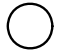
      </td>      
    </tr>
    <tr>
      <td><code>Message (Poruka):</code></td>
      <td>
Poruka od sudionika pokreće proces. Sudionik se identificira povezivanjem s Message Flow u suradnji.
      </td>
      <td>
      
      </td>      
    </tr>
    <tr>
      <td><code>Timer (Brojač):</code></td>
      <td>
Određeno vrijeme ili datum ili ciklus može pokrenuti proces.
      </td>
      <td>
      
      </td>      
    </tr>    
    <tr>
      <td><code>Conditional (Uvjet):</code></td>
      <td>
Pokreće se kad postane istinita određena uvjetna izjava (npr., "S&P 500 promijeni se za više od 10% od otvaranja" ili "Temperatura iznad 300C").   
Uvjetna izjava mora postati lažna, pa opet istinita prije ponovnog pokretanja događaja.
  
Ne smije se odnositi na kontekst podataka procesa, već može koristiti statičke atribute procesa i stanja entiteta u okolini.
      </td>
      <td>
      
      </td>      
    </tr>
    <tr>
      <td><code>Signal (Signal)</code></td>
      <td>
Pokreće se dolaskom signala iz drugog procesa.
      </td>
      <td>
      
      </td>      
    </tr>
    <tr>
      <td><code>Multiple (Višestruk)</code></td>
      <td>
Ukazuje na više načina pokretanja procesa.
      </td>
      <td>
      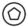
      </td>      
    </tr>
    <tr>
      <td><code>Parallel Multiple (Paralelni Višestruki)</code></td>
      <td>
 Potrebni su svi tipovi okidača navedeni u Start Event-u prije instanciranja procesa.
      </td>
      <td>
      
      </td>      
    </tr>
  </tbody>
</table>

---

### Start Events za Event PodProcese

---

> Start Event može također pokrenuti ugrađeni Event Sub-Proces. U tom slučaju, dopuštene su iste vrste događaja kao i za granu događaja, to su: *Message, Timer, Escalation, Error, Compensation, Conditional, Signal, Multiple, i Parallel*. 

Event Sub-Proces **MORAJU** imati jedan Start Event.

### Event Sub-Process Start Event Types (Vrste Početnih Događaja Za PodProcese):

<table>
  <thead>
    <tr>
      <th>Trigger (Okidač)</th>
      <th>Opis</th>
      <th>Marker</th>
    </tr>
  </thead>
  <tbody>
    <tr>
      <td><code>Message (Poruka)</code></td>
      <td>
Ako Start Event ima samo jednu povezanu definiciju događaja, a ta definicija pripada podklasi MessageEventDefinition, tada je taj događaj Message Start Event.

- Za Message Event Sub-Proces koji prekida svoj sadržavajući proces, granica događaja je neprekidna (gornja slika desno). 
- Za Message Event Sub-Proces koji ne prekida svoj sadržavajući proces, granica događaja je isprekidana (donja slika desno).
      </td>
      <td>
      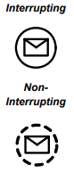
      </td>      
    </tr>
    <tr>
      <td><code>Timer (Brojač)</code></td>
      <td>
Ako Start Event ima samo jednu povezanu definiciju događaja, a ta definicija pripada podklasi TimerEventDefinition, tada je taj događaj Timer Start Event.
- Za Timer Event Sub-Proces koji prekida svoj sadržavajući proces, granica događaja je neprekidna (gornja slika desno).
- Za Timer Event Sub-Proces koji ne prekida svoj sadržavajući proces, granica događaja je isprekidana (donja slika desno).
      </td>
      <td>
      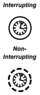
      </td>      
    </tr>
    <tr>
      <td><code>Escalation (Eskalacija)</code></td>
      <td>
 Start Event ima samo jednu povezanu definiciju događaja, a ta definicija pripada podklasi EscalationEventDefinition, tada je taj događaj Escalation Start Event.
 - Za Escalation Event Sub-Proces koji prekida svoj sadržavajući proces, granica događaja je neprekidna (gornja slika desno).
 - Za Escalation Event Sub-Proces koji ne prekida svoj sadržavajući proces, granica događaja je isprekidana (donja slika desno).
      </td>
      <td>
      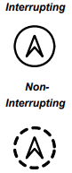
      </td>      
    </tr>
    <tr>
      <td><code>Error (Greška)</code></td>
      <td>
Ako Start Event ima samo jednu povezanu definiciju događaja, a ta definicija pripada podklasi ErrorEventDefinition, tada je taj događaj Error Start Event.
  
S obzirom na prirodu grešaka, Event Sub-Proces s okidačem pogreške uvijek će prekinuti svoj sadržavajući proces.
      </td>
      <td>
      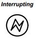
      </td>      
    </tr>
    <tr>
      <td><code>Compensation (Kompenzacija)</code></td>
      <td>
Ako Start Event ima samo jednu povezanu definiciju događaja, a ta definicija pripada podklasi CompensationEventDefinition, tada je taj događaj Compensation Start Event. 
  
Ovaj događaj ne prekida proces jer proces mora biti dovršen prije nego što ovaj događaj može biti okidač.
      </td>
      <td>
      
      </td>      
    </tr>
    <tr>
      <td><code>Conditional (Uvjet)</code></td>
      <td>
Ako Start Event ima samo jednu povezanu definiciju događaja, a ta definicija pripada podklasi ConditionalEventDefinition, tada je taj događaj Conditional Start Event.
- Za Conditional Event Sub-Process koji prekida svoj nadređeni proces, granica događaja je neprekinuta (vidi gornju sliku desno).
- Za Conditional Event Sub-Process koji ne prekida svoj nadređeni proces, granica događaja je isprekidana (vidi donju sliku desno).
      </td>
      <td>
      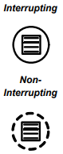
      </td>      
    </tr>
    <tr>
      <td><code>Signal (Signal)</code></td>
      <td>
Ako Start Event ima samo jednu povezanu definiciju događaja, a ta definicija pripada podklasi SignalEventDefinition, tada je taj događaj Signal Start Event.
- Za Signal Event Sub-Process koji prekida svoj nadređeni proces, granica događaja je neprekinuta (vidi gornju sliku desno).
- Za Signal Event Sub-Process koji ne prekida svoj nadređeni proces, granica događaja je isprekidana (vidi donju sliku desno).
      </td>
      <td>
      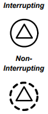
      </td>      
    </tr>
    <tr>
      <td><code>Multiple (Višestruk)</code></td>
      <td>
Multiple Start Event ukazuje da postoji više načina pokretanja Event Sub-Processa. Samo jedan od njih JE OBAVEZAN da zapravo pokrene Event Sub-Process.
- Za Multiple Event Sub-Process koji prekida svoj nadređeni proces, granica događaja je neprekinuta (vidi gornju sliku desno).
- Za Multiple Event Sub-Process koji ne prekida svoj nadređeni proces, granica događaja je isprekidana (vidi donju sliku desno).
      </td>
      <td>
      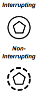
      </td>      
    </tr>
    <tr>
      <td><code>Parallel Multiple (Paralelni Višestruki)</code></td>
      <td>
Parallel Multiple Event ukazuje da postoji više načina pokretanja Event Sub-Processa. Svi su OBAVEZNI da pokrenu Event Sub-Process.
- Za Parallel Multiple Event Sub-Process koji prekida svoj nadređeni proces, granica događaja je neprekinuta (vidi gornju sliku desno).
- Za Parallel Multiple Event Sub-Process koji ne prekida svoj nadređeni proces, granica događaja je isprekidana (vidi donju sliku desno).
      </td>
      <td>
      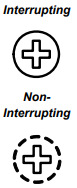
      </td>      
    </tr>
    <tr>
      <td><code>Parallel Multiple (Paralelni Višestruki)</code></td>
      <td>
Parallel Multiple Event ukazuje da postoji više načina pokretanja Event Sub-Processa. Svi su OBAVEZNI da pokrenu Event Sub-Process.
- Za Parallel Multiple Event Sub-Process koji prekida svoj nadređeni proces, granica događaja je neprekinuta (vidi gornju sliku desno).
- Za Parallel Multiple Event Sub-Process koji ne prekida svoj nadređeni proces, granica događaja je isprekidana (vidi donju sliku desno).
      </td>
      <td>
      
      </td>      
    </tr>
  </tbody>
</table>

---

### End Event (Završni Događaj)

---

> Nema odlazne Sequence Flowove, označava završetak procesa. Konzumira token generiran iz Start Eventa na istoj razini procesa. Ako su paralelni Sequence Flowovi usmjereni prema End Eventu, tokeni će se trošiti kako pristižu. Svi tokeni generirani unutar procesa moraju biti konzumirani prije završetka. 

- Može biti više End Eventova na istoj razini procesa.
- End Event je opcionalan, ali ako postoji Start Event, mora postojati barem jedan End Event.
- Ako End Event nije korišten, svi Flow Objects bez odlaznih Sequence Flowova označavaju kraj puta u procesu, ali proces ne smije završiti dok svi paralelni putevi ne budu završeni.

| Devet vrsta: *None, Message, Escalation, Error, Cancel, Compensation, Signal, Terminate i Multiple*

### Event Sub-Process Start Event Types (Vrste Početnih Događaja Za PodProcese):

<table>
  <thead>
    <tr>
      <th>Trigger (Okidač)</th>
      <th>Opis</th>
      <th>Marker</th>
    </tr>
  </thead>
  <tbody>
    <tr>
      <td><code>None (Bez okidača)</code></td>
      <td>
Ako End Event ima samo jednu povezanu definiciju događaja, a ta definicija nije specifična podklasa EventDefinition, tada je taj događaj None End Event i bit će prikazan bez oznake.
      </td>
      <td>
      
      </td>      
    </tr>
    <tr>
      <td><code>Message (Poruka)</code></td>
      <td>
Označava slanje poruke sudioniku na kraju procesa. Stvarni sudionik od kojeg se prima poruka može se identificirati povezivanjem događaja sa sudionikom putem tijeka poruke unutar definicijske suradnje procesa.
      </td>
      <td>
      
      </td>      
    </tr>
    <tr>
      <td><code>Error (Greška)</code></td>
      <td>
Označava da bi se trebala generirati greška. Svi trenutačno aktivni procesi u određenom Sub-Processu se prekidaju kao rezultat.
  
Grešku će uhvatiti Catch Error Intermediate Event s istim errorCode-om ili bez errorCode-a, koji se nalazi na granici najbliže ugniježđene nadređene aktivnosti (hijerarhijski).
  
Ponašanje procesa nije određeno ako niti jedna aktivnost u hijerarhiji nema takav Catch Error Intermediate Event. 
  
Sustav koji izvršava proces može definirati dodatno rukovanje greškama u tom slučaju, pri čemu je često jedna od opcija prekidanje instance procesa.
      </td>
      <td>
      
      </td>      
    </tr>
    <tr>
      <td><code>Escalation (Eskalacija)</code></td>
      <td>
Označava da bi trebala biti pokrenuta eskalacija. Ostali aktivni procesi nisu pogođeni i nastavljaju se izvršavati. 
  
Eskalacija će biti uhvaćena Catch Escalation Intermediate Eventom s istim escalationCode-om ili bez escalationCode-a, koji se nalazi na granici najbliže ugniježđene nadređene aktivnosti (hijerarhijski).
  
Ponašanje procesa nije određeno ako niti jedna aktivnost u hijerarhiji nema takav Catch Escalation Intermediate Event.
      </td>
      <td>
      
      </td>      
    </tr>
    <tr>
      <td><code>Cancel (Otkaži)</code></td>
      <td>
Koristi se unutar Transaction Sub-Processa. Ukazuje da bi transakcija trebala biti poništena i pokrenut će Cancel Intermediate Event pričvršćen za granicu Sub-Processa.
  
Ukazuje da bi trebala biti poslana TransactionProtocol Cancel Message svim entitetima uključenim u transakciju.
      </td>
      <td>
      
      </td>      
    </tr>
    <tr>
      <td><code>Compensation (Kompenzacija)</code></td>
      <td>
Ukazuje na potrebu za kompenzacijom. Ako je identificirana aktivnost i uspješno je dovršena, tada će ta aktivnost biti kompenzirana.
  
Aktivnost mora biti vidljiva iz Compensation End Eventa, tj. jedan od sljedećih uvjeta mora biti ispunjen:

- Compensation End Event je sadržan u normalnom toku na istoj razini Sub-Processa.
- Compensation End Event je sadržan u Compensation Event Sub-Processu koji je sadržan u Sub-Processu koji sadrži aktivnost.
- Ako nijedna aktivnost nije identificirana, sve uspješno dovršene aktivnosti vidljive iz Compensation End Eventa bit će kompenzirane, obrnutim redoslijedom njihovih Sequence Flowova. Vidljivo znači jedno od sljedećeg:
  - Compensation End Event je sadržan u normalnom toku na istoj razini Sub-Processa kao aktivnosti.
  - Compensation End Event je sadržan u Compensation Event Sub-Processu koji je sadržan u Sub-Processu koji sadrži aktivnosti.

Da bi bila kompenzirana, aktivnost mora imati granicu Compensation Eventa ili sadržavati Compensation Event Sub-Process.
      </td>
      <td>
      
      </td>      
    </tr>
    <tr>
      <td><code>Signal (Signal)</code></td>
      <td>
Ukazuje na to da će se signal emitirati kada se postigne kraj. Napomena da signal, koji se šalje svakom procesu koji može primiti signal, može se poslati između različitih razina procesa ili pools (bazena), ali nije poruka (koja ima određeni izvor i odredište).
      </td>
      <td>
      
      </td>      
    </tr>
    <tr>
      <td><code>Terminate (Prekid)</code></td>
      <td>
Ukazuje na to da bi sve aktivnosti u procesu trebale biti odmah završene. To uključuje sve instance, više instanci. Proces završava bez kompenzacije ili upravljanja događajima.
      </td>
      <td>
      
      </td>      
    </tr>
    <tr>
      <td><code>Multiple (Višestruk)</code></td>
      <td>
Označava da postoji više posljedica završetka procesa, a sve će se one dogoditi (npr. može biti poslano više poruka).
      </td>
      <td>
      
      </td>      
    </tr>
  </tbody>
</table>

### Intermediate Event (Srednji događaj) 

---

> Označava mjesto gdje se nešto događa između početka i kraja procesa. Utječe na tijek procesa, ali ne pokreće ga izravno niti ga završava. Može se koristiti za prikazivanje očekivanih ili poslanih poruka, kašnjenja, prekida uobičajenog toka ili dodatnog rada potrebnog za kompenzaciju.

- Srednji događaj je krug s dvostrukom tankom linijom.
- Debljina linije mora ostati dvostruka kako bi se srednji događaj razlikovao od početnog i završnog događaja.
- Može se koristiti za prikazivanje iznimki ili kompenzacije, postavljanjem na granicu zadatka ili podprocesa.
- Postoji dvanaest vrsta srednjih događaja u BPMN: *None, Message, Timer, Escalation, Error, Cancel, Compensation, Conditional, Link, Signal, Multiple i Parallel Multiple*
- Srednji događaji u normalnom toku mogu biti korišteni za pokretanje ili hvatanje događaja, ovisno o tome želi li se događaj pokrenuti ili čekati na okidač.

<table>
  <thead>
    <tr>
      <th>Trigger (Okidač)</th>
      <th>Opis</th>
      <th>Marker</th>
    </tr>
  </thead>
  <tbody>
    <tr>
      <td><code>None (Bez Okidača)</code></td>
      <td>
None srednji događaj je isključivo valjan u normalnom toku, tj. NE MOŽE se koristiti na granici aktivnosti. Iako nema određenog okidača za ovaj događaj, definiran je kao događaj "throw" (bacanje). Koristi se za modeliranje metodologija koje koriste događaje kako bi označile neku promjenu stanja u procesu.
  
Ovaj događaj se koristi za označavanje promjene stanja u procesu i baca se, iako nema određen okidač.
      </td>
      <td>
      
      </td>      
    </tr>
    <tr>
      <td><code>Message (Poruka)</code></td>
      <td>
Koristi se za slanje ili primanje poruke. Ispunjen marker označava "slanje" poruke (slika gore desno), dok prazan marker označava "uhvaćanje" poruke (slika dolje desno). To uzrokuje nastavak procesa ako je čekao na poruku ili mijenja tijek za obradu iznimki. Sudionik od kojeg je poruka primljena identificira se putem tokova poruka u definiranoj suradnji procesa.
      </td>
      <td>
      
      </td>      
    </tr>
    <tr>
      <td><code>Timer (Brojač)</code></td>
      <td>
U normalnom tijeku, Timer Intermedijarni Događaj djeluje kao mehanizam odgode temeljen na određenom vremenu i datumu ili određenom ciklusu (npr. svaki ponedjeljak u 9 sati). 
      </td>
      <td>
      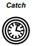
      </td>      
    </tr>
    <tr>
      <td><code>Escalation (Eskalacija)</code></td>
      <td>
U normalnom tijeku, Escalation Intermedijarni Događaj pokreće eskalaciju. Budući da je ovo Throw Događaj, strelica će biti ispunjena.
      </td>
      <td>
      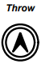
      </td>      
    </tr>
    <tr>
      <td><code>Compensation (Kompenzacija)</code></td>
      <td>
U normalnom toku, ovaj Intermedijarni Događaj ukazuje da je potrebna kompenzacija. Stoga se koristi za "bacanje" Compensation Događaja. Ako je identificirana aktivnost i uspješno je završena, tada će se ta aktivnost kompenzirati. Aktivnost mora biti vidljiva iz Compensation Intermedijarnog Događaja, tj. jedan od sljedećeg mora biti istinit:

- Compensation Intermediate Event je sadržan u normalnom toku na istoj razini podprocesa.
- Compensation Intermediate Event je sadržan u Compensation Event Sub-Processu koji je sadržan u podprocesu koji sadrži aktivnost.

Ako nije identificirana nikakva aktivnost, sve uspješno završene aktivnosti vidljive iz Compensation Intermedijarnog Događaja kompenziraju se u obrnutom redoslijedu njihovih Sequence Flowa. Vidljivo znači jedno od sljedećeg:
  - Compensation Intermediate Event je sadržan u normalnom toku i na istoj razini podprocesa kao aktivnosti.
  - Compensation Intermediate Event je sadržan u Compensation Event Sub-Processu koji je sadržan u podprocesu koji sadrži aktivnosti.
      </td>
      <td>
      
      </td>      
    </tr>
    <tr>
      <td><code>Conditional (Uvjet)</code></td>
      <td>
Ovaj tip događaja aktivira se kada uvjet postane istinit.
      </td>
      <td>
      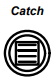
      </td>      
    </tr>    
    <tr>
      <td><code>Link (Link)</code></td>
      <td>
Link Intermedijarni događaji su važeći samo u normalnom toku, tj. NE MOGU se koristiti na granici aktivnosti. Link predstavlja mehanizam povezivanja dvaju dijelova procesa. Link događaji mogu se koristiti za stvaranje petlji ili izbjegavanje dugih toka sekvenciranja. Upotreba Link događaja ograničena je na razinu pojedinog procesa (tj. ne mogu povezati nadređeni proces s podprocesom). Također se mogu koristiti kao generički objekti "Idi na" unutar razine procesa. Može postojati više izvora Link događaja, ali može postojati samo jedan ciljni Link događaj.

- Kada se koristi za "bacanje" prema ciljnom Linku, marker događaja bit će ispunjen (pogledaj gornju sliku s desne strane).
- Kada se koristi za "hvatanje" sa izvornog Linka, marker događaja bit će prazan (pogledaj donju sliku s desne strane).
      </td>
      <td>
      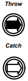
      </td>      
    </tr>   
    <tr>
      <td><code>Signal (Signal)</code></td>
      <td>
Signal Intermedijarni događaji koriste se za slanje ili primanje signala. Signal služi za opću komunikaciju unutar i između razina procesa, preko pool (bazena), i između dijagrama poslovnih procesa. Dakle, postoji izvor signala, ali nema određenog namijenjenog cilja.

- Kada se koristi za "hvatanje" signala, marker događaja bit će prazan (pogledaj srednju sliku s desne strane).
- Kada se koristi za "bacanje" signala, marker događaja bit će ispunjen.
      </td>
      <td>
      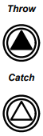
      </td>      
    </tr>
    <tr>
      <td><code>Multiple (Višestruki)</code></td>
      <td>
To znači da su događaju dodijeljeni višestruki okidači. Ako se koristi unutar normalnog toka, događaj može "uhvatiti" okidač ili "baciti" okidače. Kada je povezan s granicom aktivnosti, događaj može samo "uhvatiti" okidač.

- Kada se koristi za "hvatanje" okidača, samo je jedan od dodijeljenih okidača OBAVEZAN, a marker događaja bit će prazan (pogledaj srednju sliku s desne strane).

- Kada se koristi za "bacanje" okidača, svi dodijeljeni okidači bit će bačeni, a marker događaja bit će ispunjen (pogledaj gornju sliku s desne strane).
      </td>
      <td>
      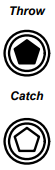
      </td>      
    </tr>
    <tr>
      <td><code>Parallel Multiple (Paralelni Višestruki)</code></td>
      <td>
To znači da su događaju dodijeljeni višestruki okidači. Ako se koristi unutar normalnog toka, događaj može samo "uhvatiti" okidač. Kada je povezan s granicom aktivnosti, događaj može samo "uhvatiti" okidač. Za razliku od normalnog višestrukog intermedijarnog događaja, SVI dodijeljeni okidači MORAJU biti zadovoljene da bi se događaj pokrenuo.
      </td>
      <td>
      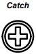
      </td>      
    </tr>
  </tbody>
</table>

---

### Intermediate Events Attached to an Activity Boundary (Srednji Događaji Povezani s Granicom Aktivnosti):

<table>
  <thead>
    <tr>
      <th>Trigger (Okidač)</th>
      <th>Opis</th>
      <th>Marker</th>
    </tr>
  </thead>
  <tbody>
    <tr>
      <td><code>Message (Poruka)</code></td>
      <td>
Poruka od sudionika pokreće događaj. Ako je povezan s granicom aktivnosti, mijenja normalni tok u iznimni tok kada se pokrene.

- Za prekid aktivnosti, granica događaja je neprekidna (vidi gornju sliku).

- Za događaj koji ne prekida aktivnost, granica događaja je isprekidana (vidi donju sliku). 
      </td>
      <td>
      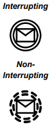
      </td>      
    </tr>
    <tr>
      <td><code>Timer (Brojač)</code></td>
      <td>
Postavljanje određenog vremena ili datuma ili određenog ciklusa (npr., svaki ponedjeljak u 9 sati) pokreće događaj. Ako je povezan s granicom aktivnosti, mijenja normalni tok u iznimni tok kad se pokrene.

- Za prekid aktivnosti, granica događaja je neprekidna (vidi gornju sliku). 

- Za događaj koji ne prekida aktivnost, granica događaja je isprekidana (vidi donju sliku).
      </td>
      <td>
      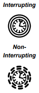
      </td>      
    </tr>
    <tr>
      <td><code>Escalation (Eskalacija)</code></td>
      <td>
Koristi se za rukovanje imenovanom eskalacijom. Ako je povezan s granicom aktivnosti, srednji događaj hvata eskalaciju. Za razliku od pogreške, pretpostavlja se da eskalacija prema zadanim postavkama ne prekida aktivnost kojoj je granica događaja povezana. 

- Za Eskalacijski događaj koji prekida aktivnost kojoj je povezan, granica događaja je neprekidna (vidi gornju sliku).
- Za Eskalacijski događaj koji ne prekida aktivnost kojoj je povezan, granica događaja je isprekidana (vidi donju sliku).
      </td>
      <td>
      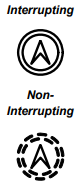
      </td>      
    </tr>
    <tr>
      <td><code>Error (Greška)</code></td>
      <td>
Koristi se za hvatanje imenovane greške i može biti povezan samo s granicom aktivnosti; ne koristi se u normalnom toku. U ovom kontekstu reagira na catches (hvatanje) grešku ili bilo koju grešku ako nije navedeno ime.
      </td>
      <td>
      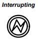
      </td>      
    </tr>
    <tr>
      <td><code>Cancel (Otkaži)</code></td>
      <td>
Koristi se unutar transakcijskog podprocesa i obavezno je povezan s granicom podprocesa. Bit će aktiviran ako se dosegne završni događaj "Cancel" unutar transakcijskog podprocesa ili ako se primi poruka "Cancel" prema protokolu transakcije dok se transakcija izvodi.
      </td>
      <td>
      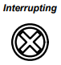
      </td>      
    </tr>
    <tr>
      <td><code>Compensation (Kompenzacija)</code></td>
      <td>
Koristi se za "hvatanje" događaja kompenzacije na granici aktivnosti. Bit će aktiviran bacanjem kompenzacije usmjerene prema toj aktivnosti. Kada se događaj aktivira, izvest će se kompenzacijska aktivnost povezana s događajem.
  
Kompenzacije se mogu pokrenuti samo nakon završetka aktivnosti kojoj su povezane. Stoga ne mogu prekinuti aktivnost.
      </td>
      <td>
      
      </td>      
    </tr>
    <tr>
      <td><code>Conditional (Uvjet)</code></td>
      <td>
Aktivira se kada postane istinit uvjet, gdje je uvjet vrsta izraza. Ako je uvjetni događaj povezan s granicom aktivnosti, promijenit će se normalni tijek u iznimni tijek nakon što bude aktiviran.

- Za uvjetni događaj koji prekida aktivnost kojoj je povezan, granica događaja je neprekinuta (vidi gornju sliku).
- Za uvjetni događaj koji ne prekida aktivnost kojoj je povezan, granica događaja je isprekidana (vidi donju sliku).
      </td>
      <td>
      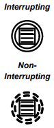
      </td>      
    </tr>
    <tr>
      <td><code>Signal (Signal)</code></td>
      <td>
Može primati Signal kada je povezan s granicom aktivnosti. U ovom kontekstu, promijenit će se normalni tijek u iznimni tijek nakon što bude aktiviran. Signal Event se razlikuje od Error Event-a jer Signal definira općenitiji, non-error uvjet za prekidanje aktivnosti (kao što je uspješno dovršenje druge aktivnosti) te ima širi opseg od Error Event-a.

- Za Signal Event koji prekida aktivnost kojoj je povezan, granica događaja je neprekinuta (vidi gornju sliku).
- Za Signal Event koji ne prekida aktivnost kojoj je povezan, granica događaja je isprekidana (vidi donju sliku).
      </td>
      <td>
      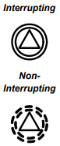
      </td>      
    </tr>
    <tr>
      <td><code>Multiple (Višestruki)</code></td>
      <td>
Označava da postoji više okidača povezanih s događajem. Kada je povezan s granicom aktivnosti, događaj može samo catch (uhvatiti) okidač. U ovom slučaju, samo je jedan od dodijeljenih okidača OBAVEZAN, a marker događaja bit će neispunjen kada se aktivira. Događaj koji se dogodio promijenit će normalni tijek u iznimni tijek.

- Za Multiple Event koji prekida aktivnost kojoj je povezan, granica događaja je neprekinuta (vidi gornju sliku).
- Za Multiple Event koji ne prekida aktivnost kojoj je povezan, granica događaja je isprekidana (vidi donju sliku).
      </td>
      <td>
      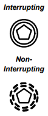
      </td>      
    </tr>
    <tr>
      <td><code>Parallel Multiple (Paralelni Višestruki)</code></td>
      <td>
Ovo označava da postoji više okidača povezanih s događajem. Kada je povezan s granicom aktivnosti, događaj može samo "uhvatiti" okidač. Za razliku od normalnog Multiple Intermediate Event-a, SVE dodijeljene okidače POTREBNO je uhvatiti da bi se događaj aktivirao.

- Za Paralelni Višestruki Događaj koji prekida aktivnost kojoj je povezan, granica događaja je neprekinuta (vidi gornju sliku). 
- Za Paralelni Višestruki Događaj koji ne prekida aktivnost kojoj je povezan, granica događaja je isprekidana (vidi donju sliku). 
      </td>
      <td>
      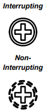
      </td>      
    </tr>
  </tbody>
</table>

## Types of All Events and their Markers (Sve Vrste Događaja i njihovi Markeri)

